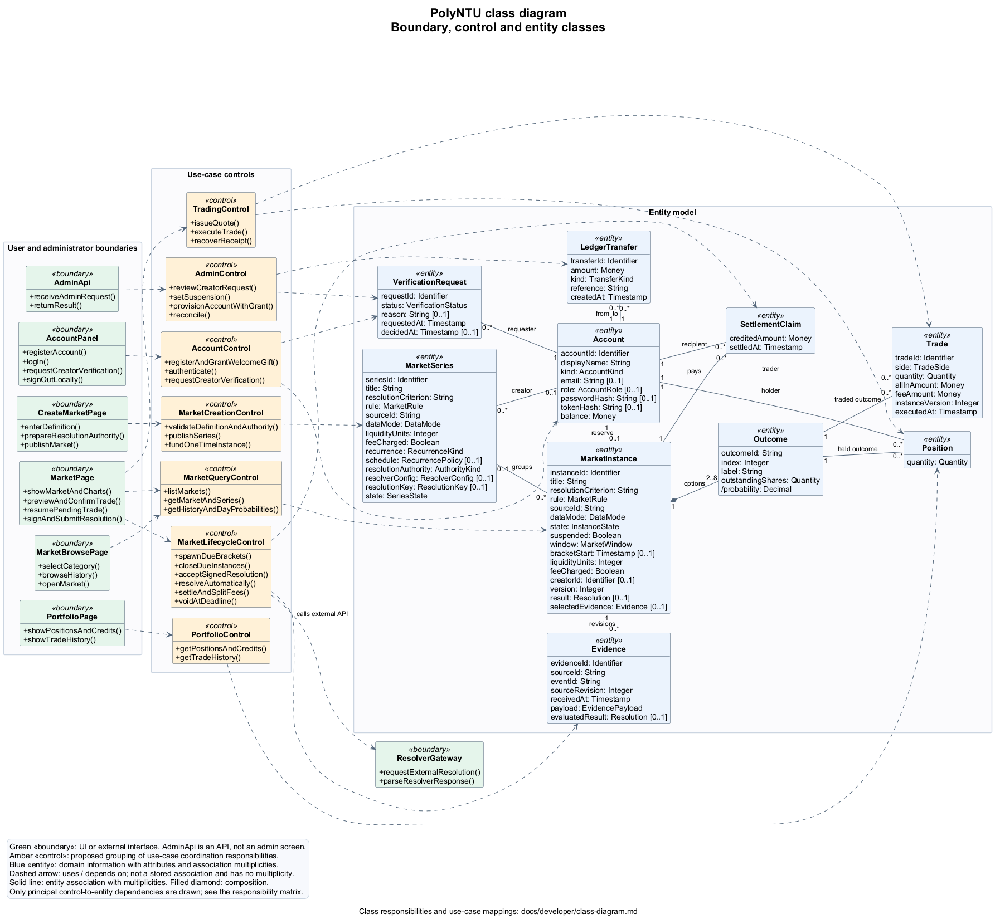

# Class diagram

This draft describes PolyNTU's **entity, boundary, and control classes**, including entity attributes, relationships, and key operations. It uses the existing [use cases](use-cases.md) as input. It is an initial design model for team review, not a claim that every named class already exists literally in the Rust/React code.

The diagram has **10 entity classes, 7 boundary classes, and 7 control classes**. One self-contained PlantUML file defines the complete diagram; its PNG is the image to view or include in a report.

## Diagram



[Open image](../diagrams/class-diagram.png) | [Editable PlantUML source](../diagrams/class-diagram.puml)

Green `<<boundary>>` classes handle interaction with people or external systems. Amber `<<control>>` classes coordinate use cases and enforce rules. Blue `<<entity>>` classes represent domain information with identity. Dashed arrows are dependencies; solid lines are entity associations. The diagram shows principal control-to-entity dependencies; the responsibility matrix below lists the other participating entities.

## Entity classes

| Entity | Responsibility and identity |
|---|---|
| Account | Participant identity and balance, or an issuance, treasury, or reserve balance. Identified by `accountId`. |
| VerificationRequest | Creator application, status, and decision reason. Identified by `requestId`. |
| MarketSeries | Immutable market definition, recurrence, fee choice, and resolution authority. Identified by `seriesId`. A one-time market is also a series. |
| MarketInstance | One concrete tradable occurrence with its own deadlines, inventory, reserve, and result. Identified by `instanceId`; this is `Instance` in the use cases/code. |
| Outcome | One published option and its outstanding inventory. Identified by its instance plus `index`; `outcomeId` is also unique within the instance. Probability is derived. |
| Position | An account's holdings in an outcome. Identified by the account/outcome pair; zero quantity may remain after a complete sale. |
| Trade | An executed buy or sell, including fee and all-in amount. Identified by `tradeId`. |
| Evidence | One evidence revision and its evaluated result, if available. Identified by `evidenceId`. |
| SettlementClaim | Final credit processed for an account in an instance, including a zero credit. Identified by the account/instance pair. |
| LedgerTransfer | One balanced movement of units between two accounts. Identified by `transferId`, with a unique business `reference`. |

### Relationships and constraints

- An account can submit many verification requests, with at most one pending. Every request has one requester.
- An account can create many series. A series has zero or one creator: no creator means platform-owned.
- A series can group many instances. A successfully published one-time series has exactly one; a recurring series can have none before spawning or after retention cleanup. An instance can have no series when created directly by the administrator.
- Each instance has exactly one reserve account. An account is reserve for at most one retained instance. Reserve accounts survive instance purging, so this association is not composition.
- `MarketInstance.creatorId` is an optional reference to an Account, separate from its reserve. It copies the series creator for spawned brackets and can be supplied for direct creation. It is represented as an attribute to avoid a second Account/MarketInstance line. Creators cannot trade their own instances.
- An instance owns 2 to 8 outcomes, each belonging to exactly one instance. This is composition. Positions and trades each connect one account to one outcome; that outcome identifies their instance.
- An instance can receive many evidence revisions. `selectedEvidence`, when present, must belong to that instance. Creator authority requires a valid signature under the fixed public key; resolver authority uses the fixed endpoint. Neither can be overridden by an administrator.
- A claim connects one account to one instance. The pair is unique, preventing duplicate payout credits. One winning share pays one unit; a void pays `1 / numberOfOutcomes` per share, aggregated per account and rounded down to the microcredit.
- Every ledger transfer has one source and one destination account, which must differ. Account balances reconcile to transfers; market reserves must cover remaining liabilities.
- Published definitions, schedules, outcomes, fee choices, and resolution authority are immutable. The instance state, suspension, inventory, evidence selection, and version change under the published rules.
- Fee-charging markets collect 25 basis points per trade. At settlement the creator gets half the fee pot rounded down to the microcredit, and the treasury receives the remainder. With no creator, the treasury receives all fees; fee-free markets have no fee pot.

### Attribute types and embedded values

The diagram groups related settings into value types. These values do not have independent identity and are not additional entity classes or proposed new database tables.

| Type | Meaning or fields |
|---|---|
| Identifier | Stable string identifier, including fixed system account identifiers. |
| Money / Quantity | Exact units / shares. Storage uses integer microcredits (1 unit = 1,000,000) and millishares (1 share = 1,000). |
| Timestamp | An instant, stored as Unix milliseconds. Display and recurring operating windows use Singapore time. |
| AccountKind / AccountRole | `user`, `treasury`, `reserve`, `issuance` / `member`, `creator`, `admin`. Role and registered credentials are absent for unregistered demo/provisioned accounts and system accounts. |
| VerificationStatus | `pending`, `approved`, `rejected`. |
| RecurrenceKind / SeriesState | `once`, `recurring` / `active`, `ended`. |
| InstanceState | `open`, `closed`, `resolving`, `resolved`, `voided`. Suspension is a separate Boolean. |
| AuthorityKind / DataMode / TradeSide | `admin`, `creator`, `resolver` / `simulated`, `manual` / `buy`, `sell`. |
| TransferKind | `issuance`, `grant`, `subsidy`, `buy`, `sell`, `resolution`, `release`, `fee`. |
| RecurrencePolicy | `intervalMs: Integer`, `activeStartMinute: Integer`, `activeEndMinute: Integer`, `activeDays: Set<Integer>`, `maxConcurrency: Integer`, `anchorAt: Timestamp`, `endAt: Timestamp [0..1]`. Required for recurring series; no end means perpetual. |
| MarketWindow | `closeAt`, `observationStartAt`, `observationEndAt`, `finalizeAfterAt`, `evidenceDeadlineAt`, all timestamps, satisfying `close <= observationStart < observationEnd <= finalizeAfter < evidenceDeadline`. |
| ResolverConfig | `endpoint: URL`, fixed at publication for resolver authority. |
| ResolutionKey | `publicKey: String`, the fixed ed25519 public key for creator authority. No private signing key is stored in these entities. |
| MarketRule | Tagged weather, bus, election, or count parameters, matching the current domain rules. |
| EvidencePayload | Either a normalized observation with its reference, a signed creator statement (outcome, nonce, signature, public key), or the recorded external resolver request/response and selected outcome. The observation form covers rainfall, bus arrivals, election result, or count data with relevant completion/finality flags. |
| Resolution | Either `winner(outcomeIndex)` or `void(reason)`; absent until determined. |

Registered accounts have email, password hash, and role together; user accounts have a token hash. Plaintext passwords and session tokens are not persisted as entity attributes. `Trader`, `Market Creator`, and `Platform Admin` are actor roles, not Account subclasses. Approval changes the role of an existing account.

## Boundary classes

| Boundary | Responsibility | Corresponding code or interface |
|---|---|---|
| AccountPanel | Account entry, creator-verification request/status, and local sign-out. Groups the related account interactions rather than introducing a new screen. | Account dialog, header account chip, and verification panel in [App.jsx](../../frontend/src/App.jsx). |
| MarketBrowsePage | Category filtering, live/history listings, and opening an instance. | [MarketBrowse.jsx](../../frontend/src/pages/MarketBrowse.jsx). The current UI has category filters, not a text-search field. |
| CreateMarketPage | Collects the definition, schedule, fee choice, and authority; submits publication. Prepares the creator's public key in the browser when required. | [CreateMarket.jsx](../../frontend/src/pages/CreateMarket.jsx). |
| MarketPage | Market facts, series brackets, charts, trade preview/confirmation/recovery, and signing a creator resolution. Groups its embedded UI components. | [MarketPage.jsx](../../frontend/src/pages/MarketPage.jsx), [TradePanel.jsx](../../frontend/src/components/TradePanel.jsx), and chart components. |
| PortfolioPage | Displays holdings, settlement credits, and private trade history. | [Portfolio.jsx](../../frontend/src/pages/Portfolio.jsx). |
| AdminApi | Receives authorized administrator requests and returns results. This is an API boundary, not an invented administrator screen. | Administrator routes in [api.rs](../../backend/src/api.rs). |
| ResolverGateway | Sends a resolution request to the configured external endpoint and parses its response. The external resolver itself is outside the system. | [resolver.rs](../../backend/src/resolver.rs). |

`MarketPage.signAndSubmitResolution()` creates the signature in the browser. The control validates the submitted signature and authority; it does not receive the private signing key. `AccountPanel.signOutLocally()` clears the stored browser session and signing key; the current system does not expose a server logout/revocation operation.

## Control classes

These are proposed logical classes grouping existing responsibilities. In the current implementation, many methods live on `Store`, with thin HTTP handlers, a worker loop, and Rust helper modules. Creating this diagram does not refactor that code.

| Control | Coordination responsibility | Participating entities | Implementation mapping |
|---|---|---|---|
| AccountControl | Validate registration, grant the welcome gift atomically, authenticate and rotate sessions, and submit creator requests. | Account, VerificationRequest, LedgerTransfer. | `register_account`, `login`, `create_verification_request` in [store.rs](../../backend/src/store.rs), plus [auth.rs](../../backend/src/auth.rs). |
| MarketQueryControl | Load market/series snapshots, history, probabilities, and discovery listings. | MarketSeries, MarketInstance, Outcome, Trade. | `instances`, `instance_detail`, `instance_history`, `series_view` in [store.rs](../../backend/src/store.rs), with [amm.rs](../../backend/src/amm.rs). |
| MarketCreationControl | Require creator access, validate the published definition and authority, create the series, and fund its one-time instance. | Account, MarketSeries, MarketInstance, Outcome, LedgerTransfer. | `create_series`, `create_instance` in [store.rs](../../backend/src/store.rs), validation in [market.rs](../../backend/src/market.rs), and route authorization in [api.rs](../../backend/src/api.rs). |
| TradingControl | Issue signed quotes; validate and execute trades atomically; apply fees, holdings, balance checks, self-trading prohibition, and idempotency. | Account, MarketInstance, Outcome, Position, Trade, LedgerTransfer. | `quote` and `execute` in [execution.rs](../../backend/src/execution.rs). `recoverReceipt()` models retrying the same trade request/key, not a new endpoint. |
| PortfolioControl | Assemble holdings, settlement credits, and private trade history for the authenticated account. | Account, MarketInstance, Outcome, Position, Trade, SettlementClaim. | `portfolio` and `trades` in [store.rs](../../backend/src/store.rs). |
| MarketLifecycleControl | Coordinate rolling spawn, closure, signed/automatic evidence, settlement, fee split, and voiding at the deadline. | All ten entity classes except VerificationRequest. | [worker.rs](../../backend/src/worker.rs), `spawn_due_brackets` in [store.rs](../../backend/src/store.rs), [resolution.rs](../../backend/src/resolution.rs), and [fee.rs](../../backend/src/fee.rs). |
| AdminControl | Require administrator authority, approve/reject creator requests, suspend/resume instances, provision accounts with grants, and run reconciliation. | Account, VerificationRequest, MarketInstance, Outcome, Position, SettlementClaim, LedgerTransfer. | Admin handlers in [api.rs](../../backend/src/api.rs), decisions/provisioning/reconciliation in [store.rs](../../backend/src/store.rs), suspension in [resolution.rs](../../backend/src/resolution.rs). |

The lifecycle control is invoked by the internal scheduler/worker for background activity and by the market boundary for a creator's signed submission. No user screen is required to trigger automated settlement. It depends on `ResolverGateway` because external resolution is an outbound call, not a screen action.

### Example responsibilities across stereotypes

1. **Place a trade:** MarketPage captures the choice and confirmation; TradingControl validates the quote and executes the transaction; Trade, Position, Account, MarketInstance/Outcome, and LedgerTransfer reflect the result.
2. **Publish a market:** CreateMarketPage captures the definition; MarketCreationControl validates and publishes it; MarketSeries and a one-time MarketInstance are created, or the lifecycle control spawns recurring instances later.
3. **Resolve automatically:** MarketLifecycleControl asks ResolverGateway for evidence, validates the result against the published outcomes, then coordinates Evidence, SettlementClaim, Account, and LedgerTransfer changes. Pending or invalid answers retry until the deadline; unresolved instances then void.
4. **Approve a creator:** AdminApi receives an authorized decision; AdminControl updates VerificationRequest and Account; the account panel displays the resulting status on refresh.

## Use-case coverage

| Use cases | Boundary and control path |
|---|---|
| UC-1, UC-2, UC-3 | AccountPanel -> AccountControl. |
| UC-4 | PortfolioPage -> PortfolioControl; saved pending-trade recovery opens MarketPage -> TradingControl. |
| UC-5 | MarketBrowsePage -> MarketQueryControl. |
| UC-6 | AccountPanel -> AccountControl. |
| UC-7 | AdminApi -> AdminControl. |
| UC-8, UC-9, UC-10, UC-11 | CreateMarketPage -> MarketCreationControl. |
| UC-12 | Internal scheduler -> MarketLifecycleControl. |
| UC-13 | MarketLifecycleControl -> ResolverGateway. |
| UC-14 | MarketPage -> MarketLifecycleControl, carrying the browser-signed statement. |
| UC-15, UC-16, UC-17 | Internal worker -> MarketLifecycleControl. |
| UC-18 | MarketPage -> MarketQueryControl for probabilities, and TradingControl for a personal quote. |
| UC-19, UC-21 | MarketPage -> MarketQueryControl. |
| UC-20 | MarketPage -> TradingControl. |
| UC-22, UC-23, UC-24 | AdminApi -> AdminControl. |
| UC-25 | AccountPanel clears local state; no server logout control is implied. |

## Scope and implementation details

Outcome is stored in the instance's outcome JSON and corresponding inventory array, not a standalone table. ResolverConfig and ResolutionKey are embedded series values. LedgerTransfer is the stored movement; LedgerEntry is a derived two-sided view. Portfolio, price history, and DayProbability are computed views, and Quote is a temporary signed value, so none needs its own entity box in this initial model.

Operational details such as idempotency records, audit logs, SSE outbox events, caches, repositories, and startup wiring are deferred from the key class model. They remain necessary implementation mechanisms: receipt recovery uses idempotency records, while creator decisions and suspensions append audit records. The model also preserves the existing retention policy: eligible recurring instances and their associated trading/settlement records are purged, but ledger transfers and reserve accounts survive.

The initial diagram shows operation names to communicate responsibility. Full signatures, detailed entity operations, additional controls, and any design patterns can be refined for the final Lab 3 design. No new administrator UI, text-search feature, server logout endpoint, or code refactor is proposed by this draft.

## Re-rendering

Edit `docs/diagrams/class-diagram.puml`, then regenerate its PNG from the repository root:

```powershell
.\scripts\render-diagrams.ps1 -Diagram 'docs\diagrams\class-diagram.puml'
```

All entity, boundary, and control definitions are in that source file. Update this explanation when class responsibilities or relationships change.
