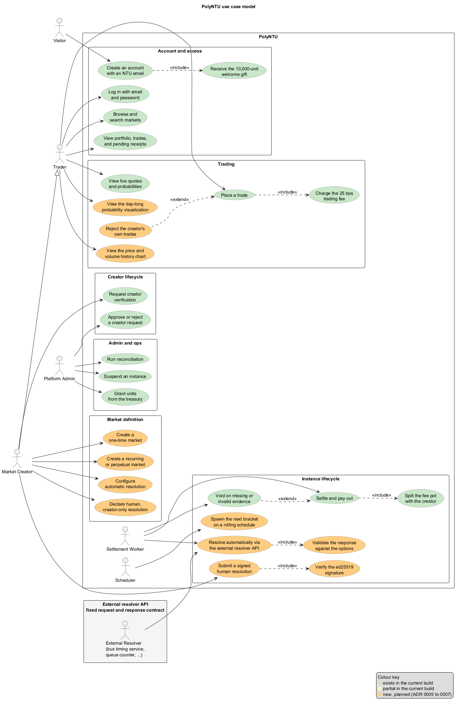

# PolyNTU use case model

This is the use case model of the PolyNTU platform: the actors, the complete register of use cases, the business rules behind them, and detailed flows for the most significant cases. The register marks each case as existing, partial, or new:

- **exists**: implemented and working in the current build;
- **partial**: a smaller or earlier version works in the current build;
- **new**: planned, not built.

Statements about existing behavior are verified against the current build. Every use case is now marked exists: [ADR 0005](../decisions/0005-ntu-accounts-and-creator-roles.md) (NTU accounts and creator roles), [ADR 0006](../decisions/0006-market-series-and-recurrence.md) (market series and recurrence), [ADR 0007](../decisions/0007-resolution-authority.md) (resolution authority), and the market-experience phase are all implemented. The one deferred item is the real bus timing adapter, a live data source rather than platform work.

## Actors

| Actor | Kind | Description |
|---|---|---|
| Visitor | Primary | An unauthenticated person who registers. UC-1 turns a Visitor into a Trader. |
| Trader | Primary | An account holder who browses markets, views quotes and probabilities, trades outcome shares, and tracks a portfolio. |
| Market Creator | Primary | A verified trader who also defines markets: one-time markets and recurring series. The role generalizes Trader, with one restriction: a creator cannot trade in their own markets, and the fee share is their compensation. |
| Platform Admin | Primary | The operator, reached through the shared token or an admin-role account session (the seeded demo administrator in demo mode). Verifies creators, suspends instances, grants units from the treasury, and runs reconciliation. Today it still creates instances directly and records evidence for platform-authority markets; by design it cannot resolve markets whose authority is fixed to their creator or an external resolver. |
| External Resolver | Secondary system | An automated external API the settlement worker calls at finalize time, for example a bus timing service or a queue counter. Secondary actor in UC-13. |
| Scheduler | Internal system | The background process that spawns bracket instances for recurring series on a rolling schedule (UC-12). |
| Settlement Worker | Internal system | The background process that closes instances, resolves them, settles and pays out claims, and voids on missing or invalid evidence (UC-13, UC-15 to UC-17). |

## Diagram

The source is `docs/diagrams/use-case.puml`; re-render it with `scripts/render-diagrams.ps1` (PlantUML, Smetana layout). Color legend: green elements exist today, yellow are partial, orange are new or planned; every use case is currently green. Scheduler and Settlement Worker are internal system actors, so they are drawn inside the PolyNTU boundary; the External Resolver sits in its own box that names the request and response contract it must honour.

## Use case register

| Area | ID | Use case | Primary actor | Status |
|---|---|---|---|---|
| Account and access | UC-1 | Create an account with an NTU email | Visitor | exists |
| Account and access | UC-2 | Log in with email and password | Trader | exists |
| Account and access | UC-3 | Receive the 10,000-unit welcome gift | Trader | exists |
| Account and access | UC-4 | View portfolio, trades, and pending receipts | Trader | exists |
| Account and access | UC-5 | Browse and search markets | Trader | exists |
| Creator lifecycle | UC-6 | Request creator verification | Trader | exists |
| Creator lifecycle | UC-7 | Approve or reject a creator request | Platform Admin | exists |
| Market definition | UC-8 | Create a one-time market | Market Creator | exists |
| Market definition | UC-9 | Create a recurring or perpetual market | Market Creator | exists |
| Market definition | UC-10 | Configure automatic resolution | Market Creator | exists |
| Market definition | UC-11 | Declare human, creator-only resolution | Market Creator | exists |
| Instance lifecycle | UC-12 | Spawn the next bracket on a rolling schedule | Scheduler | exists |
| Instance lifecycle | UC-13 | Resolve automatically via the external resolver API | Settlement Worker | exists |
| Instance lifecycle | UC-14 | Submit a signed human resolution | Market Creator | exists |
| Instance lifecycle | UC-15 | Settle and pay out | Settlement Worker | exists |
| Instance lifecycle | UC-16 | Split the fee pot with the creator | Settlement Worker | exists |
| Instance lifecycle | UC-17 | Void on missing or invalid evidence | Settlement Worker | exists |
| Trading | UC-18 | View live quotes and probabilities | Trader | exists |
| Trading | UC-19 | View the price and volume history chart | Trader | exists |
| Trading | UC-20 | Place a trade | Trader | exists |
| Trading | UC-21 | View the day-long probability visualization | Trader | exists |
| Admin and ops | UC-22 | Suspend an instance | Platform Admin | exists |
| Admin and ops | UC-23 | Grant units from the treasury | Platform Admin | exists |
| Admin and ops | UC-24 | Run reconciliation | Platform Admin | exists |

Notes:

- Visitor is the unauthenticated role that UC-1 turns into a Trader.
- UC-3: the 10,000-unit gift applies to registered accounts; the one-click demo account keeps its 1,000-unit grant as a development fixture.
- UC-20 exists today, including its creator self-trading ban alternative flow (see the detailed description).
- The diagram also shows four relationship use cases that this register does not number: Validate the response against the options (included by UC-13), Verify the ed25519 signature (included by UC-14), Charge the 25 bps trading fee (included by UC-20), and Reject the creator's own trades (extends UC-20).

## Business rules

1. Accounts require an NTU email (existing; [ADR 0005](../decisions/0005-ntu-accounts-and-creator-roles.md)). The address must match `^[^@\s]+@([a-z0-9-]+\.)*ntu\.edu\.sg$` (case-insensitive), so `billy@ntu.edu.sg` and `billy@scse.ntu.edu.sg` pass and anything else is rejected.
2. Registered accounts receive a 10,000-unit welcome gift from the treasury; the demo account keeps its 1,000-unit grant (existing; ADR 0005). Total issuance rises from 1M to 1B units, applied as a second idempotent bootstrap transfer rather than a migration, so the gift budget is not exhausted after 100 users.
3. Every trade on a fee-charging market pays a 25-basis-point fee on the LMSR amount, included in the quoted all-in amount, accumulated in the market reserve, and split 50/50 between the creator and the treasury at settlement (existing; [ADR 0004](../decisions/0004-trade-fees.md)). The fee is a market attribute fixed at creation (`fee_charged`, default true): the administrator sets it creating instances directly and creators set it publishing a series. A fee-free market charges nothing, collects no fee, and pays no creator share; bus timing is the welfare example.
4. Creators cannot trade in their own markets; the fee share is their compensation (existing).
5. A perpetual market is a recurring market with no end date: it recurs forever with automatically refreshing resolution times (existing).
6. Rolling spawn: a new bracket instance is created every interval while the live count is below the maximum concurrency; the covered horizon is maximum concurrency × interval.
7. Recurrence only spawns brackets inside the creator-set active period, a daily window interpreted in Singapore time. A bus series, for example, runs 06:00 to 23:59 because buses do not run at midnight (existing).
8. Market reserves remain treasury-funded; creators contribute definitions and earn through the fee share, not through deposits (existing).
9. The resolution authority is fixed at market creation: the platform administrator (the default), the market creator (human), or a configured external resolver endpoint (automatic) (existing; [ADR 0007](../decisions/0007-resolution-authority.md)).
10. Human resolution requires a valid ed25519 signature from the key fixed at creation. The private key is held only by the creator's browser; a lost key means the market voids by the published policy (existing; ADR 0007).
11. The administrator cannot resolve markets whose authority is fixed to their creator or an external resolver, by design (existing; ADR 0007).
12. Automatic resolution that stays unreachable, malformed, pending, or names an unpublished option through the published evidence deadline voids the market (existing; ADR 0007).
13. A market offers 2 to 8 direct outcomes (existing).

## Domain entities

| Entity | Status | Purpose |
|---|---|---|
| Account | existing | Identity and balance. Registered accounts carry a unique NTU email, an argon2 password hash, and a role (member, creator, or admin). |
| VerificationRequest | existing | A member's creator request with status and the administrator's decision and reason. |
| MarketSeries | existing | A published definition with the rule, recurrence rule (interval, active period, maximum concurrency, optional end date), liquidity, and fee policy; one-time or recurring. The resolution authority (administrator, creator key, or resolver endpoint) is fixed at creation. |
| Instance | existing | One concrete occurrence with its own inventory, reserve, evidence, and result; carries a series reference, bracket slot, and fee flag when it belongs to a series. |
| ResolverConfig | existing | The endpoint URL and fixed request contract for automatic authority. |
| ResolutionKey | existing | The ed25519 public key fixed at creation for human authority. |
| Trade | existing | The source of price and volume history. |
| LedgerEntry | existing | Every unit movement; includes the fee kind. |
| DayProbability | existing | Computed on request from live brackets, never stored. |

## Detailed descriptions

Full descriptions of the twelve most significant use cases, in ID order. A step marked "(existing)" or "(new)" appears only where one flow mixes both.

### UC-1: Create an account with an NTU email

**Precondition:** none. The visitor holds an NTU-affiliated email address.

**Flow of events:**

1. The visitor submits a display name, an email address, and a password.
2. The server validates the display name (2 to 60 characters, the current rule), the email against the NTU pattern and for uniqueness, and the password against the 12-character minimum.
3. The server creates the account with an argon2id hash of the password.
4. The 10,000-unit welcome gift transfers from the treasury to the new account.
5. The server issues a session token and returns it once.

**Alternative flows:**

- The email fails the NTU pattern: registration is rejected.
- The email is already registered: registration is rejected.
- The password is shorter than 12 characters: registration is rejected.
- The treasury gift budget is exhausted: registration is rejected.
- Development and CI: the current one-click demo account remains available in demo mode.

### UC-2: Log in with email and password

**Precondition:** an account exists.

**Flow of events:**

1. The account holder submits the email address and password.
2. The server verifies the password with argon2.
3. The server issues a fresh bearer session token, returns it once, and stores only its SHA-256 hash. Each login invalidates every previous token: an account holds at most one live session.

**Alternative flows:**

- Unknown email or wrong password: the server returns the same generic rejection for both, so accounts cannot be enumerated.
- Repeated failures: the current build has no rate limiting; rate limiting is deferred.

### UC-6: Request creator verification

**Precondition:** an authenticated member account.

**Flow of events:**

1. The member submits a verification request.
2. The server stores the request as pending.
3. The request becomes visible to the administrator.
4. Once approved through UC-7, the account holds the creator role permanently without re-verifying (creating markets as a creator is UC-8, which now exists).

**Alternative flows:**

- The account is already a creator, an administrator, or a demo account without an email: the request is rejected with a specific message.
- A pending request already exists: the request is rejected.

### UC-7: Approve or reject a creator request

**Precondition:** a pending verification request exists; the actor is the administrator.

**Flow of events:**

1. The administrator reviews the pending request.
2. The administrator approves it.
3. The account role becomes creator, permanently, and the decision is recorded in the administrator audit.
4. The requester is notified and keeps the creator role without re-verifying (creating markets as a creator is UC-8, which now exists).

**Alternative flows:**

- Reject: the administrator records a reason with the rejection and the requester is notified; the member may apply again.

### UC-8: Create a one-time market

**Precondition:** an authenticated creator.

**Flow of events:**

1. The creator submits a title, a resolution criterion, the rule (which derives 2 to 8 options), the evidence source, the liquidity, the fee choice, and one explicit window: close time, observation window, finalize deadline, and evidence deadline.
2. The server validates the submission.
3. The series and its single instance are published immutably; if the instance cannot be funded, the series is removed again.
4. The instance's reserve is subsidized from the treasury.
5. It appears in discovery.

**Alternative flows:**

- The submitter is not a creator: rejected with 403.
- Invalid or duplicated options: rejected.
- Inconsistent or past times: rejected.
- Treasury exhausted: rejected.
- An optional resolution authority (an external resolver endpoint or the creator's own signature) can be fixed at publication; see UC-10 and UC-11 ([ADR 0007](../decisions/0007-resolution-authority.md)).

### UC-9: Create a recurring or perpetual market

**Precondition:** an authenticated creator.

**Flow of events:**

1. The creator submits what UC-8 requires plus a recurrence rule: an interval (1 minute to 1 day), an active period (a daily operating window in Singapore time), a maximum concurrency (1 to 50), and an optional end date whose absence means perpetual. The fee choice applies to every bracket.
2. The server validates the submission.
3. The series is published immutably.
4. The scheduler begins rolling spawn (UC-12), and the series page shows the schedule and its brackets.

**Alternative flows:**

- Interval out of bounds: rejected.
- Concurrency above the cap: rejected.
- Empty or inverted active period: rejected.
- End date too close to leave room for one more slot: rejected.

### UC-12: Spawn the next bracket on a rolling schedule

**Precondition:** an active recurring series exists; the actor is the Scheduler.

**Flow of events:**

1. On each tick, the scheduler walks every grid slot strictly after now, up to maximum concurrency slots ahead.
2. It skips slots outside the active period, slots past the series end date, and slots that already have a bracket.
3. For each remaining slot it creates the instance for bracket [T, T+interval) with the series' rule, funds the new instance's reserve from the treasury, and publishes it.
4. A recurring series ends when its end date has passed and no non-terminal bracket remains; a one-time series ends when its single instance settles.

**Alternative flows:**

- Next slot outside the active period: skipped until the window reopens.
- Series end date reached: spawning stops; the live brackets run out and settle.
- A spawn fails, for example when the treasury is exhausted: the failure is logged per series and retried on the next tick.

Worked example: a bus series with a 2-minute interval and maximum concurrency 5 always holds five live brackets covering a rolling 10-minute horizon, and a new bracket appears every 2 minutes.

### UC-13: Resolve automatically via the external resolver API

**Precondition:** the instance is closed and inside its finalize window, and the series has a resolver endpoint.

**Flow of events:**

1. The settlement worker calls the endpoint with the fixed request contract: instance identifier, bracket window, and rule parameters.
2. The response is parsed.
3. The result is checked against the published option set.
4. A valid result is recorded as evidence and settlement proceeds.

**Alternative flows:**

- Endpoint unreachable: retried on every worker tick (one second) until the published evidence deadline.
- Response malformed or naming no published option: treated as missing evidence and retried.
- Endpoint reports pending: retried.
- Nothing valid by the deadline: the instance voids per the published policy.

### UC-14: Submit a signed human resolution

**Precondition:** a creator-owned market with human authority. The instance is closed, the creator's browser holds the market's ed25519 private key, and the matching public key was fixed at creation.

**Flow of events:**

1. The creator selects the outcome in the interface.
2. The client signs (instance id, outcome, nonce) with the private key.
3. The server verifies the signature against the stored public key.
4. The resolution is recorded and settlement proceeds.

**Alternative flows:**

- Signature invalid: rejected.
- The submitter is not the creator: rejected.
- The market is not closed: rejected.
- An administrator attempts it: rejected by design; the admin evidence route refuses markets with creator or resolver authority, and no valid signature exists.
- The private key is lost: resolution is impossible and the instance voids at the deadline.

### UC-19: View the price and volume history chart

**Precondition:** an instance exists and the page is open.

**Flow of events:**

1. The backend returns the historical series: time-bucketed outcome prices and traded volume, reconstructed by replaying recorded trades from the opening inventory.
2. The chart renders alongside the live probability, one line per outcome plus a volume histogram.
3. Each market event on the existing SSE stream triggers a full history refresh (with a five-second fallback poll), like a stock chart.

**Alternative flows:**

- No trades yet: a flat line at opening prices and zero volume.
- Connection drop: the existing durable SSE cursor replays missed events on reconnect.

### UC-20: Place a trade

**Precondition:** an authenticated account, an open instance, and a sufficient balance (all existing).

**Flow of events:**

1. The account requests a quote: signed, bound to the account and market version, expiring within 15 seconds, and all-in including the 25-basis-point fee on fee-charging markets (existing).
2. The account confirms.
3. The server rechecks the quote, account, market version, cutoff, balance, holdings, and reserve inside one transaction and executes atomically with idempotency (existing).
4. The receipt is returned and an SSE event is published (existing).

**Alternative flows:**

- Expired quote: rejected (existing).
- Insufficient balance: rejected (existing).
- Closed market: rejected (existing).
- Limit not met: rejected (existing).
- Duplicate delivery: the same receipt is returned (existing).
- The account is the creator of this instance: rejected (existing); creators cannot trade their own markets, and the fee share is their compensation.

### UC-21: View the day-long probability visualization

**Precondition:** a recurring series exists with live or settled brackets.

**Flow of events:**

1. The trader opens the series page.
2. The backend aggregates per slot: weighted probability = the sum over live brackets of (units bet in that bracket × its first-outcome price), divided by the total units bet across those brackets; null until a live bracket has traded.
3. The chart shows each slot's first-outcome probability across the listed brackets, with per-slot volume bars.
4. Settled slots are pinned to their resolved value; voided slots are omitted from the line.
5. Live slots refresh through the series page's five-second reload.

**Alternative flows:**

- No live bracket has traded volume yet: the headline says the weighted probability appears with the first trade.
- A single live bracket: its weighted probability is its own price.
